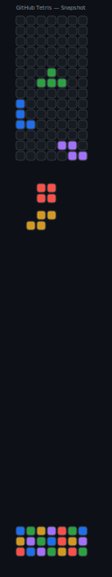

# GitHub Tetris on Contribution Grid

This repository renders a Tetris simulation onto a GitHub contribution-style grid and updates automatically via GitHub Actions.

- Grid: 52 columns × 7 rows (days × weeks)
- Frame-based updates: falling pieces move down one row per run
- Line clearing: full rows disappear, upper rows shift down, new row inserted at the top

## Live SVG



### Troubleshooting
- If you see "Invalid image source", ensure `tetris/tetris.svg` is committed and the path/case matches exactly.
- View the raw image at `https://raw.githubusercontent.com/<owner>/<repo>/<branch>/tetris/tetris.svg` to confirm it exists.
- On GitHub, paths are case-sensitive; verify the folder name is `tetris`.

## How it works

- Python script `tetris/engine.py` updates the persistent game `tetris/state.json`, applies gravity, fixes pieces, clears lines, and generates `tetris/tetris.svg`.
- GitHub Actions runs on a schedule (every ~12 minutes) and pushes changes.

## Local Run

```bash
python tetris/engine.py
```

No JavaScript is used; the SVG is safe to embed in README.
